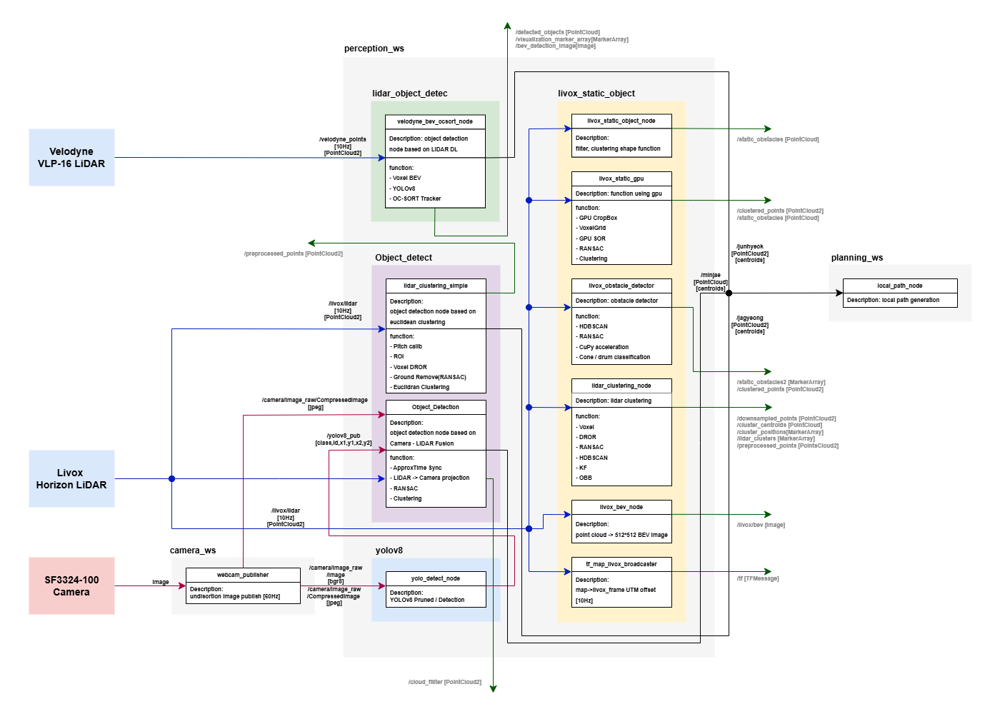

# 2025 Clothoid-R Perception (JEJU)

Clothoid-R 자율주행 시스템의 Perception ROS workspace.  
카메라와 LiDAR 기반 객체 검출, 클러스터링, 추적, 센서 퓨전 패키지로 구성됩니다.

**제4회 국제 대학생 EV 자율주행 경진대회**  
Advanced 자율주행 모빌리티 레이스 1/2 부문 · 최우수상

  

## Team

<div align="center">
<table align="center">
<tr>
<td align="center" width="180">
  <a href="https://github.com/JaGyeong1024"><br /><sub><b>구자경</b></sub></a><br />Camera-LiDAR<br />Sensor Fusion
</td>
<td align="center" width="180">
  <a href="https://github.com/junhyeok797"><br /><sub><b>서준혁</b></sub></a><br />LiDAR, <br />Deep Learning
</td>
<td align="center" width="180">
  <a href="https://github.com/Minjea31"><br /><sub><b>김민재</b></sub></a><br />Camera, <br />Model Optimization
</td>
<td align="center" width="180">
  <a href="https://github.com/ysjee0229"><br /><sub><b>지연수</b></sub></a><br />Camera, <br />Deep Learning
</td>
<td align="center" width="180">
  <br /><sub><b>유인석</b></sub><br />Camera, <br />Hardware
</td>
</tr>
</table>
</div>

## Pipeline



| Pipeline | Input | Output | Package |
|---|---|---|---|
| Camera publish | SF3324-100 camera | `/camera/image_raw/compressed` | `camera_start` |
| Camera YOLO | `/camera/image_raw/compressed` | `/yolov8_pub` | `yolov8` |
| Livox clustering | `/livox/lidar` (Livox Horizon) | `/jagyeong` | `Object_detect` |
| Livox-camera fusion | `/livox/lidar`, `/camera/image_raw/compressed`, `/yolov8_pub` | `/minjae` | `Object_detect` |
| Velodyne BEV detection | `/velodyne_points` (Velodyne VLP-16) | `/detected_objects` | `Object_detect` |

Livox-camera fusion: synchronize LiDAR, camera and YOLO topics → project LiDAR points into the image → keep points inside YOLO boxes → ROI + RANSAC ground removal → clustering and centroids → Kalman tracking.

## Layout

| Path | Contents |
|---|---|
| `perception_ws/` | Perception packages, custom ultralytics (`yolov8_prune/`), conda `environment.yml` |
| `system_ws/` | Camera driver (`camera_start`) |

## Packages

`perception_ws/src`:

| Package | Role |
|---|---|
| `Object_detect` | Livox-camera fusion (C++), Livox euclidean clustering, Velodyne BEV detection with OC-SORT |
| `yolov8` | Camera YOLOv8 detection (pruned model) |
| `lidar_object_detec` | Velodyne BEV model weights |
| `detect_msgs` | Shared perception messages |
| `livox_static_object` | Livox static obstacle detection (experimental) |

`system_ws/src`:

| Package | Role |
|---|---|
| `camera_start` | Camera capture and undistortion publisher |

## Output Topics

| Topic | Type |
|---|---|
| `/yolov8_pub` | `detect_msgs/Yolo_Objects` |
| `/jagyeong` | `sensor_msgs/PointCloud` |
| `/minjae` | `sensor_msgs/PointCloud` |
| `/detected_objects` | `sensor_msgs/PointCloud` |

## Requirements

- Ubuntu 20.04
- ROS Noetic
- Conda
- NVIDIA GPU/CUDA, optional

## Setup

```bash
git clone https://github.com/JaGyeong1024/2025-Clothoid-R-Perception-JEJU.git
cd 2025-Clothoid-R-Perception-JEJU
```

Conda env and custom ultralytics (run `pip uninstall ultralytics` first if a stock version is installed):

```bash
conda env create -f perception_ws/environment.yml
conda activate clothoid
pip install -e perception_ws/yolov8_prune
pip install torch torchvision pyyaml
```

Workspace build:

```bash
source /opt/ros/noetic/setup.bash
cd system_ws && catkin_make && source devel/setup.bash && cd ..
cd perception_ws && catkin_make && source devel/setup.bash && cd ..
```

## Run

Source ROS and each workspace's `devel/setup.bash` in every terminal; the YOLO terminal also needs `conda activate clothoid`.

```bash
roscore
roslaunch camera_start start.launch            # camera
roslaunch yolov8 yolo_detect.launch            # camera YOLO (start before fusion)
roslaunch Object_detect detect.launch          # fusion + Velodyne BEV
rosrun Object_detect euclidean_clustering.py   # Livox clustering
```

`model_path` in `detect.launch` and the `yolov8_prune` path in `yolo_detect.py` are absolute paths; adjust them to your machine.

## Verification

```bash
rosnode list
```

```text
/camera_start_node
/yolo_detect_node
/object_detection_node
/velodyne_object_detection_node
/lidar_clustering_simple
```

```bash
rostopic info /yolov8_pub
rostopic info /jagyeong
rostopic info /minjae
rostopic info /detected_objects
```
